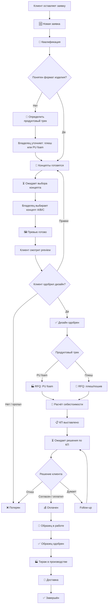

# Новая воронка сделки: PU foam + плюшевые мягкие игрушки

Дата: 26 мая 2026  
Причина обновления: продуктовая стратегия смещена с одного формата `PU foam антистресс` на два производственных трека:

1. `🧸 Плюш / мягкая игрушка`
2. `🟠 PU foam / антистресс`

Также канал WhatsApp должен быть заменён на `MAX`.

## 1. Главная идея новой воронки

Старая воронка предполагала, что почти любая заявка ведёт к PU foam изделию. Теперь это опасно: у плюшевой игрушки другая логика дизайна, другая себестоимость, другие вопросы к поставщику, другой sample и другой визуальный prompt.

Поэтому в CRM нужно явно хранить:

- `Продуктовый трек`
- `Материал / формат`
- `Сложность изделия`
- `Нанесение логотипа`
- `Нужна одежда/аксессуары`
- `Размер изделия`
- `Статус образца`

## 2. Рекомендуемые статусы

```text
🆕 Новая заявка
🔎 Квалификация
🧭 Определить продуктовый трек
🎨 Концепты готовятся
⏳ Ожидает выбора концепта
🖼 Превью готово
⏳ Ожидает ответа по дизайну
✅ Дизайн одобрен
🏭 RFQ: PU foam
🧵 RFQ: плюш/пошив
🧮 Расчёт себестоимости
📋 КП выставлено
⏳ Ожидает решения по КП
💰 Оплачен
🧪 Образец в работе
✅ Образец одобрен
🏭 Тираж в производстве
🚚 Доставка
✅ Завершён
❌ Потерян
```

## 3. Общая схема



## 4. Что означает каждый статус

| Статус | Что означает | Кто ставит | Автоматизация | Ручное действие |
|---|---|---|---|---|
| `🆕 Новая заявка` | Лид пришёл с сайта/мессенджера | n8n | Создаёт клиента и сделку, пишет источник, канал, дату | Проверить адекватность заявки |
| `🔎 Квалификация` | Нужно понять, есть ли реальный заказ | Владелец или n8n | Может подсветить тираж, контакт, материалы | Уточнить вводные, отсечь мусор |
| `🧭 Определить продуктовый трек` | Неясно, нужен плюш или PU foam | n8n/владелец | Ставит, если текст заявки не позволяет уверенно определить формат | Уточнить у клиента формат |
| `🎨 Концепты готовятся` | Можно генерировать идеи | n8n | Готовит концепты с учётом продуктового трека | Обычно ничего |
| `⏳ Ожидает выбора концепта` | Концепты A/B/C готовы | n8n | Сохраняет JSON и отправляет в Telegram владельцу | Выбрать лучший вариант |
| `🖼 Превью готово` | Изображение выбранного концепта создано | n8n | Генерирует preview, пишет prompt и вариант в CRM | Проверить визуал и отправить клиенту |
| `⏳ Ожидает ответа по дизайну` | Клиент получил preview и думает | Владелец | Follow-up по `Следующий контакт` | Напомнить клиенту |
| `✅ Дизайн одобрен` | Клиенту нравится визуальный вариант | Владелец | Запускает уведомление владельцу по RFQ | Перейти к поставщикам |
| `🏭 RFQ: PU foam` | Нужен запрос цены для PU foam изделия | n8n | Telegram-напоминание владельцу | Писать поставщикам PU foam |
| `🧵 RFQ: плюш/пошив` | Нужен запрос цены для плюшевой игрушки | n8n | Telegram-напоминание владельцу | Писать поставщикам плюша/пошива |
| `🧮 Расчёт себестоимости` | Получены вводные от поставщика | Владелец | Ссылка на калькулятор | Внести цены, доставку, sample, маржу |
| `📋 КП выставлено` | Цена отправлена клиенту | Владелец | Follow-up контроль | Зафиксировать текст КП |
| `⏳ Ожидает решения по КП` | Клиент думает по цене | Владелец | Напоминания | Дожимать/отвечать |
| `💰 Оплачен` | Клиент оплатил | Владелец | Можно запускать следующий этап | Проверить оплату |
| `🧪 Образец в работе` | Производится sample | Владелец | Можно контролировать дату | Следить за sample |
| `✅ Образец одобрен` | Sample принят | Владелец | Готово к тиражу | Запустить тираж |
| `🏭 Тираж в производстве` | Производится партия | Владелец | Можно ставить контрольные даты | Контроль сроков/качества |
| `🚚 Доставка` | Заказ едет | Владелец | Можно хранить трек/сроки | Контроль логистики |
| `✅ Завершён` | Сделка закрыта успешно | Владелец | Аналитика | Собрать отзыв/кейс |
| `❌ Потерян` | Отказ/мусор/нет ответа | Владелец | Хранит причину | Заполнить причину |

## 5. Разница RFQ для двух треков

### PU foam

Нужно спросить у поставщика:

- цена EXW за штуку;
- стоимость формы;
- стоимость покраски/печати;
- sample;
- MOQ;
- вес 1 шт;
- размер;
- срок формы;
- срок тиража;
- упаковка;
- доставка по Китаю;
- ограничения по форме;
- где будет технологический шов.

### Плюш / мягкая игрушка

Нужно спросить у поставщика:

- цена за штуку;
- MOQ;
- размер изделия;
- тип ткани/ворса;
- наполнитель;
- вышивка или принт логотипа;
- нужна ли одежда/аксессуары;
- сложность выкройки;
- стоимость sample;
- срок sample;
- срок тиража;
- упаковка;
- доставка по Китаю;
- сертификация/возрастная маркировка.

## 6. Новые поля Airtable

Рекомендуемые поля в таблице `Сделки`:

| Поле | Тип | Зачем |
|---|---|---|
| `Продуктовый трек` | single select | `🧸 Плюш / мягкая игрушка`, `🟠 PU foam / антистресс`, `❓ Не определён` |
| `Материал / формат` | single line text | Плюш, велюр, PU foam, комбинированный вариант |
| `Сложность изделия` | single select | простая, средняя, сложная |
| `Размер изделия см` | number/text | Для расчёта и RFQ |
| `Тип нанесения логотипа` | single select | вышивка, принт, бирка, surface print, без логотипа |
| `Одежда / аксессуары` | checkbox | Важно для плюшевых игрушек |
| `Статус образца` | single select | не нужен, нужен, в работе, одобрен, правки |
| `Стоимость sample ₽` | number | Отдельно от формы/печати |
| `MOQ поставщика` | number | Минимальный тираж |
| `Срок sample дней` | number | Контроль ожидания |
| `Срок тиража дней` | number | Для КП клиенту |
| `Канал связи` | single select | добавить `max`, убрать использование WhatsApp |

## 7. MAX вместо WhatsApp

На сайте и в CRM канал должен называться:

```text
max
```

Что меняется:

- кнопки `Написать в WhatsApp` заменяются на `Написать в MAX`;
- событие Метрики становится `messenger_max_click`;
- ссылка берётся из env-переменной сайта `VITE_MAX_CTA_URL`;
- в Airtable `Канал связи` должен поддерживать значение `max`;
- в n8n `contactChannel` должен выбирать `max`, если заявка пришла через MAX.

## 8. Что нужно изменить в n8n

### `01 — Новая заявка с лендинга`

Добавить:

- распознавание `productTrack`;
- распознавание `max`;
- запись `Продуктовый трек`;
- если трек не определён — статус `🧭 Определить продуктовый трек`;
- если трек определён — можно ставить `🎨 Концепты готовятся`.

### `02 — Генерация концептов`

Prompt должен уметь два сценария:

- если `Продуктовый трек = 🧸 Плюш / мягкая игрушка`, генерировать plush-toy concepts;
- если `Продуктовый трек = 🟠 PU foam / антистресс`, генерировать PU foam concepts;
- если `❓ Не определён`, предложить минимум один плюшевый и один PU foam вариант.

Для плюша prompt должен требовать:

- мягкая игрушка с тканью/ворсом;
- видимые швы как часть пошива, если уместно;
- набивка, округлая безопасная форма;
- вышивка/принт/бирка для логотипа;
- отсутствие невозможных мелких деталей;
- реалистичный factory sample.

Для PU prompt должен оставить:

- PU foam;
- цельная форма;
- технологический mold parting line;
- surface print;
- отсутствие тонких деталей.

### `03 — Выбор концепта → Генерация изображения`

Сохранять не только `Одобренный вариант`, но и:

- `Продуктовый трек`;
- `Материал / формат`;
- `Одобренный prompt`.

### `03 — Уведомление: дизайн одобрен`

После `✅ Дизайн одобрен` переводить:

- в `🏭 RFQ: PU foam`, если трек PU;
- в `🧵 RFQ: плюш/пошив`, если трек плюш;
- в `🧭 Определить продуктовый трек`, если трек не определён.

## 9. Что остаётся ручным

Пока вручную:

- уточнение неясного продуктового трека;
- общение с поставщиками;
- проверка sample;
- перенос финальных цифр в КП;
- финальное решение по цене;
- производство/доставка.

Автоматизация должна не заменять эти решения, а подсказывать, кто и на каком этапе завис.
